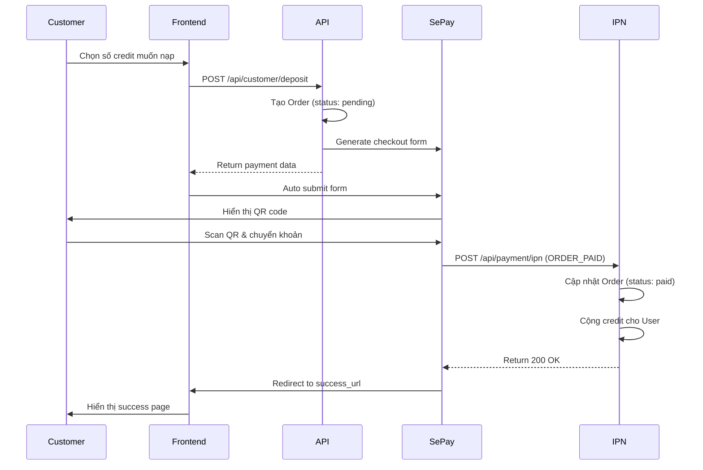

# Hướng dẫn Setup Tính năng Nạp Credit

## Tổng quan

Tính năng nạp credit cho phép customer nạp tiền vào tài khoản để mua token. Hệ thống sử dụng **SePay Payment Gateway** để xử lý thanh toán qua chuyển khoản ngân hàng.

**Tỷ giá**: 1 credit = 1,000 VND

## Cấu trúc

### 1. Models

#### Order Model (`models/Order.ts`)
Lưu trữ thông tin đơn hàng nạp credit:
- `orderInvoiceNumber`: Mã đơn hàng duy nhất
- `creditAmount`: Số credit được nạp
- `orderAmount`: Số tiền VND (creditAmount × 1000)
- `orderStatus`: pending | paid | failed | cancelled
- `transactionId`: ID giao dịch từ SePay
- `ipnData`: Dữ liệu IPN từ SePay

### 2. API Endpoints

#### a) Tạo đơn nạp credit
**POST** `/api/customer/deposit`

Request body:
```json
{
  "creditAmount": 100
}
```

Response:
```json
{
  "success": true,
  "order": {
    "id": "...",
    "orderInvoiceNumber": "CREDIT-1234567890-ABC123",
    "creditAmount": 100,
    "orderAmount": 100000,
    "orderStatus": "pending"
  },
  "payment": {
    "checkoutURL": "https://pay.sepay.vn/v1/checkout/init",
    "checkoutFormfields": {
      // SePay form fields
    }
  }
}
```

#### b) IPN Webhook
**POST** `/api/payment/ipn`

Nhận thông báo từ SePay khi thanh toán thành công. Webhook này sẽ:
1. Xác thực đơn hàng
2. Cập nhật trạng thái đơn hàng thành `paid`
3. Cộng credit vào tài khoản user

### 3. UI Pages

#### a) Trang nạp credit (`/deposit`)
- Hiển thị số dư credit hiện tại
- Các gói nạp credit phổ biến (10, 50, 100, 500, 1000)
- Nhập số credit tùy chỉnh (10-10,000)
- Tính bonus cho các gói lớn
- Form thanh toán tự động submit đến SePay

#### b) Payment Callback Pages
- `/payment/success`: Thanh toán thành công
- `/payment/error`: Thanh toán thất bại
- `/payment/cancel`: Hủy thanh toán

### 4. Sidebar
Thêm link "Nạp Credit" vào menu customer với icon Wallet.

## Cài đặt

### Bước 1: Cài đặt Dependencies

Package đã được cài đặt:
```bash
pnpm add sepay-pg-node
```

### Bước 2: Cấu hình biến môi trường

Tạo file `.env.local` (hoặc cập nhật `.env`):

```env
# SePay Payment Gateway Configuration
SEPAY_ENV=sandbox
SEPAY_MERCHANT_ID=SP-TEST-P?52B58A
SEPAY_SECRET_KEY=spsk_test_gYBHjPUFDeHrAfNPArCtxRiuRn8yZKHc

# Base URL (cập nhật theo domain của bạn)
NEXT_PUBLIC_BASE_URL=http://localhost:3000
```

**Lấy thông tin SePay:**
1. Đăng ký tài khoản tại https://my.sepay.vn/register
2. Vào "Cổng thanh toán" → "Đăng ký"
3. Chọn "Quét mã QR chuyển khoản ngân hàng"
4. Lấy MERCHANT_ID và SECRET_KEY từ màn hình tích hợp

### Bước 3: Cấu hình IPN URL

Trong dashboard SePay, cấu hình IPN URL:

**Sandbox**: `http://localhost:3000/api/payment/ipn`
**Production**: `https://yourdomain.com/api/payment/ipn`

⚠️ **Lưu ý**: 
- Localhost không thể nhận IPN từ SePay
- Để test IPN, cần deploy lên server có domain công khai hoặc dùng ngrok

### Bước 4: Test với Ngrok (Optional - cho development)

```bash
# Cài đặt ngrok
npm install -g ngrok

# Chạy Next.js app
npm run dev

# Mở tunnel (terminal khác)
ngrok http 3000

# Lấy URL (ví dụ: https://abc123.ngrok.io)
# Cập nhật NEXT_PUBLIC_BASE_URL và IPN URL trong SePay dashboard
```

## Luồng hoạt động



## Testing

### Test Sandbox (SePay Test Environment)

1. Truy cập `/deposit`
2. Chọn số credit muốn nạp (ví dụ: 10 credit = 10,000 VND)
3. Click "Thanh toán"
4. Được chuyển đến trang thanh toán SePay sandbox
5. Scan QR code (môi trường test)
6. Sau khi "thanh toán", SePay sẽ:
   - Gửi IPN notification đến `/api/payment/ipn`
   - Redirect về `/payment/success`
7. Kiểm tra:
   - Credit đã được cộng vào tài khoản
   - Order status = `paid` trong database
   - Console logs trong server

### Test Production

⚠️ **Cẩn thận**: Production sẽ thực hiện giao dịch thật

1. Cập nhật `.env`:
   ```env
   SEPAY_ENV=production
   SEPAY_MERCHANT_ID=<production_merchant_id>
   SEPAY_SECRET_KEY=<production_secret_key>
   NEXT_PUBLIC_BASE_URL=https://yourdomain.com
   ```

2. Liên kết tài khoản ngân hàng thật trong SePay dashboard
3. Cập nhật IPN URL sang production domain
4. Test với số tiền nhỏ trước

## Troubleshooting

### IPN không được gọi

1. **Kiểm tra IPN URL**: Đảm bảo URL công khai và đúng định dạng
2. **Kiểm tra logs**: Xem server logs để debug
3. **Test IPN manually**: Sử dụng Postman gửi POST request với sample IPN data
4. **Kiểm tra firewall**: Đảm bảo server có thể nhận request từ SePay

### Credit không được cộng

1. **Kiểm tra database**: Xem Order status
2. **Kiểm tra IPN logs**: Có lỗi gì trong quá trình xử lý không
3. **Kiểm tra userId**: Order có đúng userId không

### Payment redirect sai

1. **Kiểm tra NEXT_PUBLIC_BASE_URL**: Đảm bảo đúng domain
2. **Kiểm tra callback URLs**: success_url, error_url, cancel_url

## Gói Credit Bonus

Hiện tại hệ thống hỗ trợ bonus cho các gói lớn:

- 10 credit: Không bonus
- 50 credit: Không bonus
- 100 credit: +5 credit bonus
- 500 credit: +50 credit bonus  
- 1000 credit: +150 credit bonus

Để thay đổi, cập nhật `CREDIT_PACKAGES` trong `/app/(customer)/deposit/page.tsx`

## Security Notes

1. **Secret Key**: Không commit SECRET_KEY vào Git
2. **IPN Validation**: Nên implement signature validation cho IPN (hiện tại chưa có)
3. **Rate Limiting**: Nên thêm rate limit cho API endpoints
4. **HTTPS**: Production phải dùng HTTPS

## Database Indexes

Order model đã có các indexes:
- `orderInvoiceNumber`: unique index
- `userId`: index
- `orderStatus`: index
- `transactionId`: index
- Compound: `userId + createdAt`
- Compound: `orderStatus + createdAt`

## API Reference

### Create Deposit Order

```typescript
POST /api/customer/deposit

Headers:
  Authorization: Bearer <jwt_token>
  Content-Type: application/json

Body:
{
  creditAmount: number // Min: 10, Max: 10000
}

Response 200:
{
  success: true,
  order: {
    id: string,
    orderInvoiceNumber: string,
    creditAmount: number,
    orderAmount: number,
    orderStatus: 'pending'
  },
  payment: {
    checkoutURL: string,
    checkoutFormfields: object
  }
}

Response 400/403/500:
{
  error: string
}
```

### IPN Webhook

```typescript
POST /api/payment/ipn

Headers:
  Content-Type: application/json

Body: (từ SePay)
{
  timestamp: number,
  notification_type: 'ORDER_PAID',
  order: {
    order_invoice_number: string,
    order_status: string,
    order_amount: string,
    ...
  },
  transaction: {
    transaction_id: string,
    transaction_status: string,
    transaction_date: string,
    ...
  }
}

Response 200:
{
  success: true,
  message: string,
  order: object
}
```

## Future Improvements

1. ✅ Implement signature validation cho IPN
2. ✅ Thêm trang lịch sử giao dịch
3. ✅ Email notification khi nạp credit thành công
4. ✅ Admin page xem tất cả transactions
5. ✅ Refund functionality
6. ✅ Multiple payment methods (QR, Card, etc)
7. ✅ Promotion codes / Vouchers

## Support

Nếu có vấn đề, vui lòng:
1. Kiểm tra logs server
2. Kiểm tra SePay dashboard
3. Xem documentation: https://docs.sepay.vn
4. Liên hệ support SePay: https://my.sepay.vn/support

